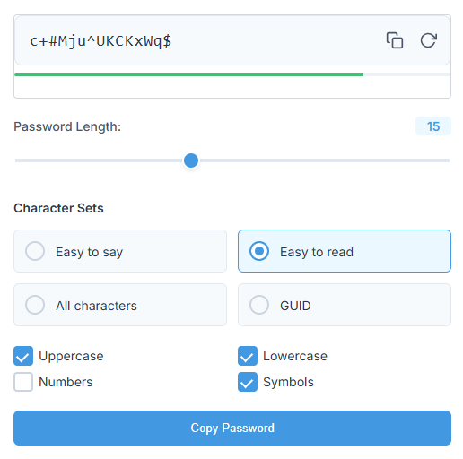

# LastPass-like Password Generator Chrome Extension

This Chrome extension provides a simple and secure way to generate strong, random passwords directly within your browser, similar to the functionality found on the LastPass website. It's built for ease of use and offers customization options for password length and character sets.

## Features

* **Fast Password Generation:** Instantly generate strong, random passwords with a single click.
* **Adjustable Password Length:** Use a slider or a number input to specify the desired password length (from 1 to 40 characters).
* **Customizable Character Sets:**
    * **Easy to Say:** Generates passwords using only easily pronounceable letters (vowels and consonants), excluding ambiguous characters like 'l', '1', 'O', and '0'. Ideal for passwords you might need to dictate or remember without writing down.
    * **Easy to Read:** Excludes visually similar characters (like 'l', '1', 'O', '0', 'I') to reduce confusion. Includes numbers and special characters, making it stronger than "Easy to Say."
    * **All Characters:** Uses the full range of uppercase letters, lowercase letters, numbers, and symbols. This option creates the strongest passwords.
    * **Individual Character Type Selection:** Fine-tune your password by individually enabling or disabling:
        * Uppercase letters (A-Z)
        * Lowercase letters (a-z)
        * Numbers (0-9)
        * Symbols (!@#$%^&*()_+=-`~[]\{}|;':",./<>?)
    * **Generate GUID:** Generates a standard UUID/GUID (e.g., 550e8400-e29b-41d4-a716-446655440000).
* **Password Strength Indicator:** A visual bar displays the estimated strength of the generated password (from very weak to very strong). This helps you choose an appropriate level of complexity.
* **One-Click Copy:** Copy the generated password to your clipboard with a single click on the "Copy" button. A confirmation popup appears briefly to indicate success.
* **Refresh Button:** There is a refresh button for easy generation of another password.
* **Lightweight and Fast:** The extension is designed to be small and efficient, with no unnecessary features or external dependencies.
* **Secure:** Password generation happens entirely within your browser. The generated password is *never* sent to any external server. The `clipboardWrite` permission is *only* used to copy the password to your clipboard when *you* click the copy button.
* **No tracking:** There is no user tracking.
* **Open Source:** The code is clear and easily auditable.

## Installation

1. **Download the Extension:**
    * Option A (Recommended for Development/Testing): Clone this repository or download the ZIP file and extract it to a folder on your computer.
    * Option B (For Distribution - *Later*): If a `.crx` file is provided, you can install it (see "Installing a Packaged Extension" below). *Do not* use the `.crx` method for development.

2. **Open Chrome's Extensions Page:**
    * Open Google Chrome.
    * Type `chrome://extensions` into the address bar and press Enter.

3. **Enable Developer Mode:**
    * In the top-right corner of the Extensions page, toggle the **Developer mode** switch to the "on" position (it will turn blue).

4. **Load Unpacked Extension:**
    * Click the **Load unpacked** button (usually on the top left).
    * A file dialog will appear. Navigate to the folder where you extracted the extension files (the folder containing `manifest.json`) and select that *folder*.
    * Click "Select Folder" (or "Open").

5. **Pin the Extension (Optional):**
    * Click the "Extensions" icon (it looks like a puzzle piece) in the Chrome toolbar.
    * Find "LastPass-like Password Generator" in the list.
    * Click the "pin" icon next to it to pin the extension to your toolbar for easy access.

## Usage

1. **Open the Popup:** Click the extension's icon in the Chrome toolbar.
2. **Adjust Settings:**
    * **Password Length:** Use the slider or the number input to set the desired password length.
    * **Character Sets:**
        * Select "Easy to say", "Easy to read", "All characters", or "Generate GUID".
        * Or, check/uncheck the individual boxes for Uppercase, Lowercase, Numbers, and Symbols.
3. **Generate Password:** Click the "Generate" button (the circular arrow icon). A new password will be generated and displayed. The strength indicator will update.
4. **Copy Password:** Click either the small "Copy" icon next to the password or the large "Copy password" button. A "Copied" popup will appear briefly.
5. **Paste Password:** Paste the copied password (Ctrl+V or Cmd+V) into the desired password field.

## Building from Source (Advanced)

If you downloaded the source code (not a `.crx` file), you can build a packaged `.crx` file for distribution:

1. **Open `chrome://extensions`:** Go to the Extensions page in Chrome.
2. **Make sure Developer Mode is enabled.**
3. **Click "Pack extension...":** This button is usually at the top left.
4. **Extension Root Directory:** Browse to and select the `password-generator-extension` folder (the one containing `manifest.json`).
5. **Private Key File (Important!):**
    * The *first* time you pack the extension, leave this field *blank*. Chrome will generate a `.pem` file (a private key) for you. **Save this `.pem` file in a safe place!** You'll need it to update your extension in the future. If you lose it, you'll have to publish the extension as a completely new extension.
    * For *subsequent* builds (updates), you *must* select the `.pem` file you generated previously.
6. **Click "Pack Extension":** Chrome will create a `.crx` file (the packaged extension) and a `.pem` file (if it's the first time).

**Installing a Packaged Extension (`.crx` file):**

*Drag and Drop (Usually Works):*

1. Locate the `.crx` file on your computer.
2. Open `chrome://extensions` in Chrome.
3. Drag the `.crx` file from your file explorer/finder and drop it onto the `chrome://extensions` page.
4. Chrome will prompt you to confirm the installation.

*If Drag and Drop Doesn't Work:*

This method is sometimes blocked for security reasons. If it fails use drag and drop.

## Permissions Explained

* **`clipboardWrite`:** This permission is required for the extension to copy the generated password to your system clipboard. The extension *only* uses this permission when you explicitly click one of the "Copy" buttons. It does *not* access your clipboard at any other time.

## Security Considerations

* **Local Generation:** All password generation happens locally within your browser. The extension does *not* send any data to external servers.
* **No Storage:** The extension does *not* store generated passwords. Once you close the popup, the password is gone (unless you've copied it).
* **Open Source:** The code is available for review, so you can verify its security.

## Contributing

If you'd like to contribute to the development of this extension, feel free to submit pull requests or open issues on the repository (if applicable - add a link to your GitHub/GitLab repo here if you have one).

## License

This extension is released under the [MIT License](LICENSE) (You'll need to create a `LICENSE` file and put the MIT License text in it). This is a very permissive license that allows for free use, modification, and distribution. You can find the full text of the MIT license online. A standard MIT license text file is included below.